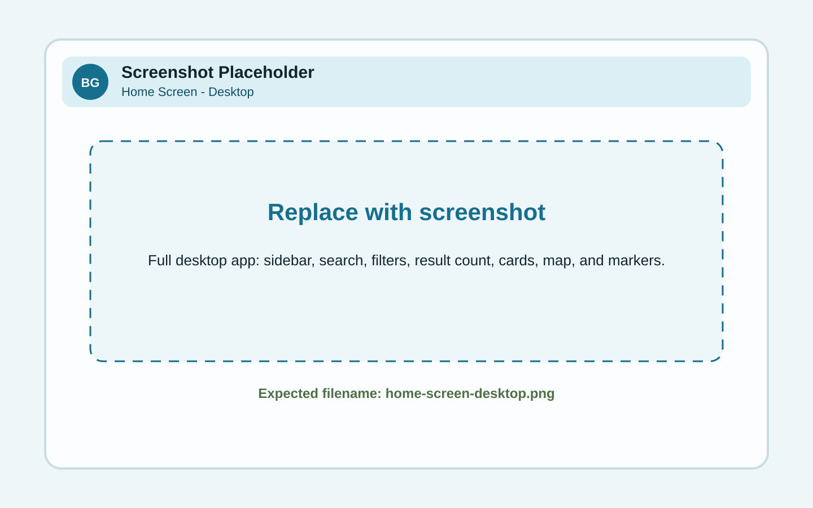
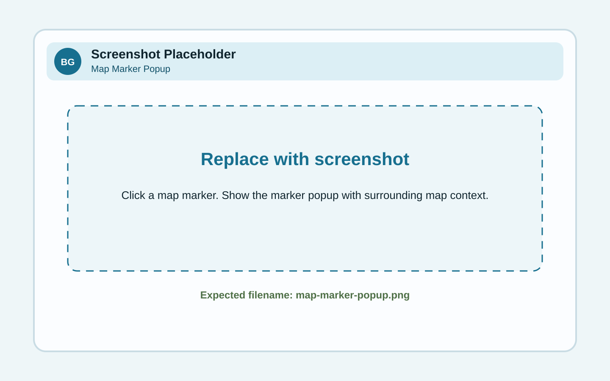
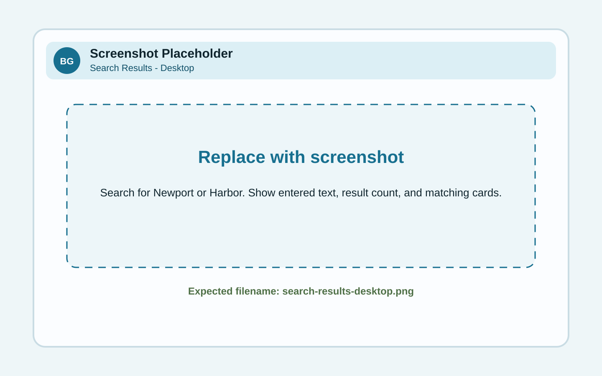
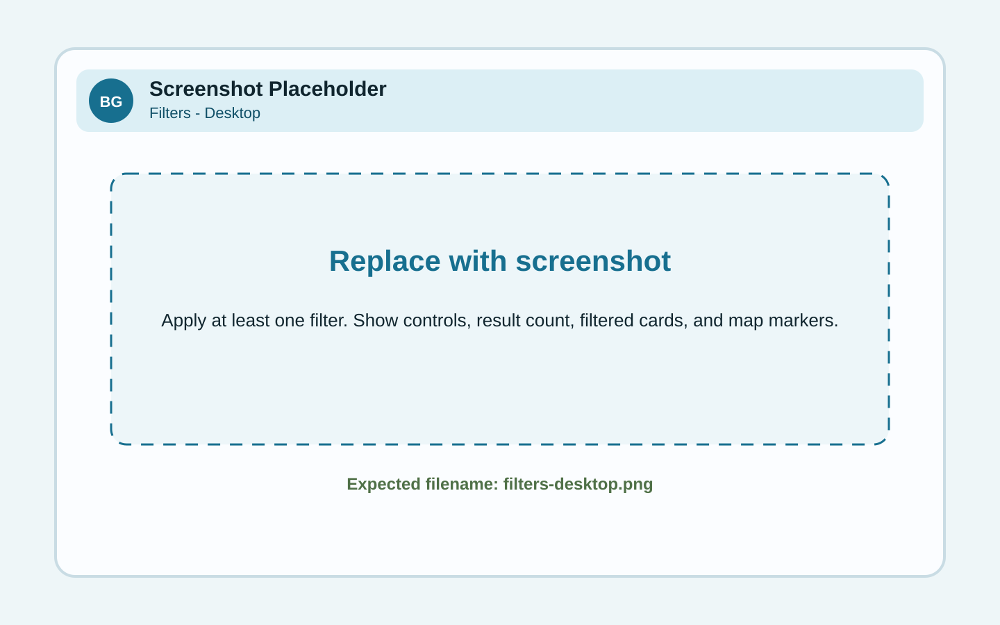
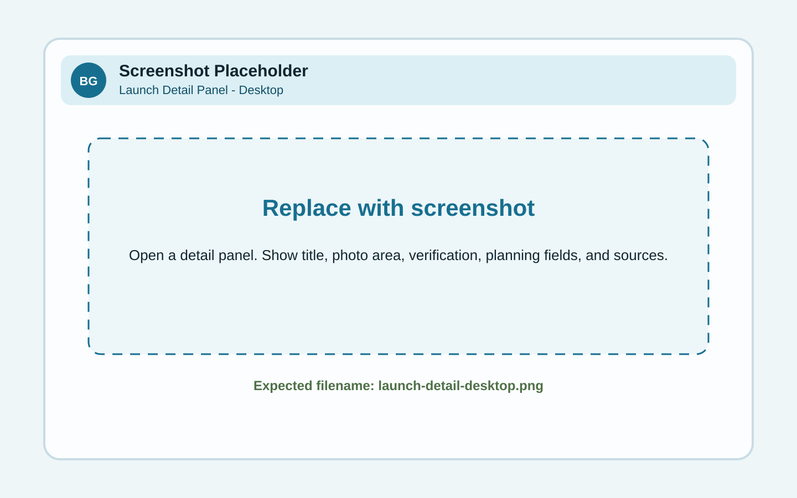
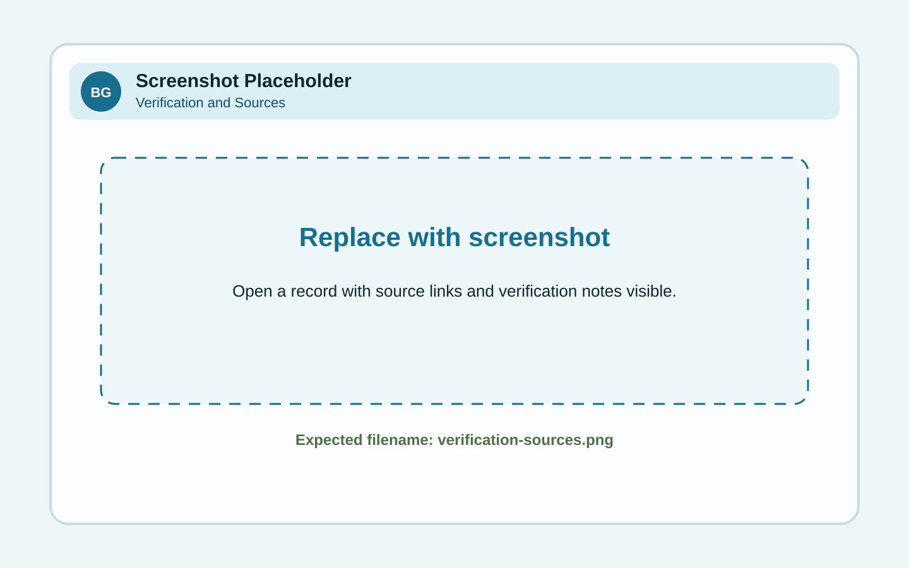
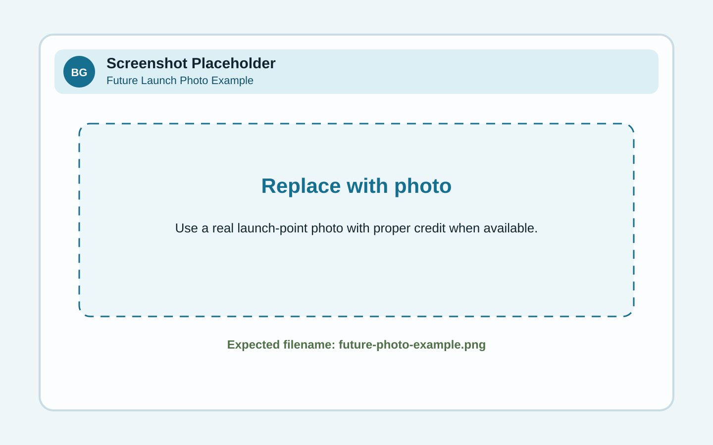
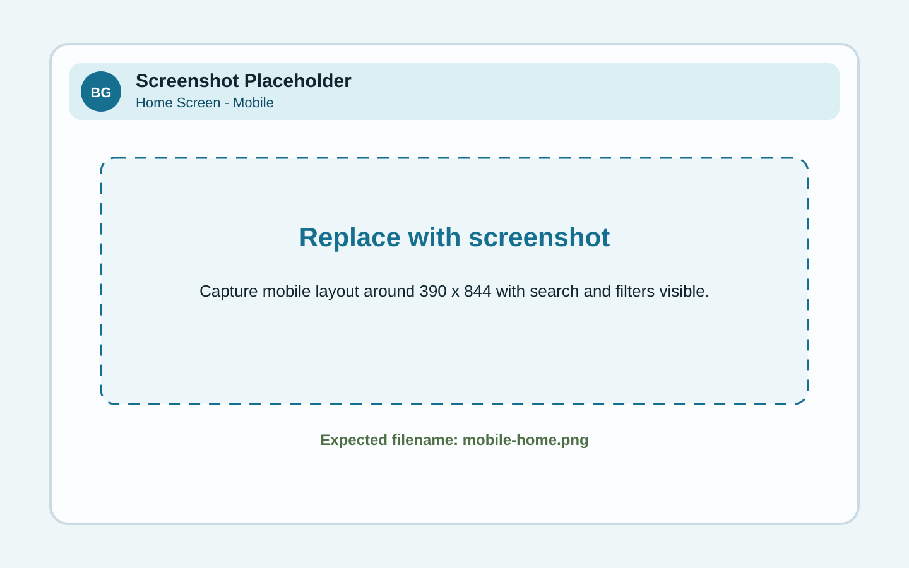
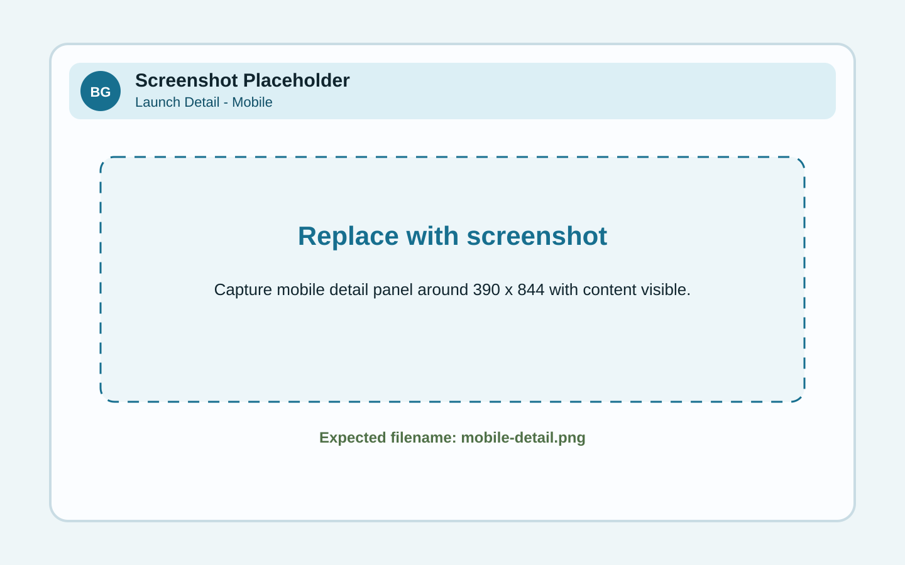

# BlueGreen Guide Field Guide & User Manual

**Version:** 1.0  
**Release type:** Curated Launch Map proof of concept  
**Audience:** People using BlueGreen Guide to find paddleboarding and kayaking launch points

BlueGreen Guide helps people find practical outdoor water experiences, starting with curated paddleboarding and kayaking launch points. This guide explains how to navigate the site, use the map, search and filter launch points, read launch cards, and understand verification notes.

> Safety note: BlueGreen Guide is a planning aid, not a live conditions or safety service. Access rules, parking, fees, tides, wind, hazards, and water conditions can change. Always check official sources before going.

---

## 1. What BlueGreen Guide is

BlueGreen Guide is a map-first outdoor discovery app focused on blue spaces and green spaces.

- **Blue spaces** are water-centered places such as oceans, bays, harbors, rivers, lakes, reservoirs, lagoons, and beaches.
- **Green spaces** are parks, trails, campgrounds, gardens, shoreline open space, and natural outdoor areas.

The first version focuses on finding places to launch a kayak, paddleboard, or canoe.

For v1.0, the app uses a curated collection of launch points rather than a nationwide database. This keeps the proof of concept focused on quality, clarity, and trust.

---

## 2. What v1.0 includes

Version 1.0 includes:

- Interactive Leaflet/OpenStreetMap launch map
- Curated launch-point dataset
- Search by place, region, activity, tags, and descriptive text
- Region, skill, activity, and difficulty filters
- Launch cards
- Launch detail panel
- Verification notes and source links where available
- Responsive mobile layout
- Documentation site and user guide

Version 1.0 does **not** include live weather, tide, wind, water temperature, accounts, reviews, or user-submitted edits. Those belong to later roadmap phases.

---

## 3. Home screen

The home screen has three main areas:

1. **Sidebar** - search, filters, result count, and launch cards.
2. **Map** - interactive view of launch locations.
3. **Detail panel** - opens when you select a launch point.

### Replace this screenshot with

- Filename: `home-screen-desktop.png`
- Recommended size: 1440 x 900 or larger
- Show: sidebar, filters, map, markers, result count, and several launch cards

---

## 4. Exploring the map

Use the map to browse launch points geographically.

Common actions:

- Drag the map to pan.
- Use the zoom buttons or mouse wheel to zoom in and out.
- Select a marker to inspect a location.
- Use **Fit all** to return to the full launch collection.
- Use **Show launch points in current map view** to narrow the list to what is visible on the map.

### Replace this screenshot with

- Filename: `map-marker-popup.png`
- Show: one selected marker with popup visible
- Keep surrounding map visible for context

---

## 5. Search

Use **Search Blue Spaces** to quickly find launch points by place name, region, activity, water type, amenity, tag, or descriptive text.

Useful searches include:

- Newport
- Marina
- Harbor
- Beginner
- Rentals
- Lake
- Dog

Search is most useful when paired with filters. For example, search for a region and then filter by beginner-friendly places.

### Replace this screenshot with

- Filename: `search-results-desktop.png`
- Search term: `Newport`, `Harbor`, or another term with multiple results
- Show: entered search text, updated result count, and matching cards

---

## 6. Filters

Filters help narrow the launch collection.

### Region

Use this to focus on a specific geographic area.

### Skill

Use this to narrow by general suitability:

- **Beginner** - generally calmer or easier to understand, but still requires checking current conditions.
- **Intermediate** - may involve more exposure, boat traffic, distance, wind, or situational awareness.
- **Advanced** - may involve more demanding conditions or planning needs.

### Activity

Use this to find places that support SUP, kayak, or canoe.

### Max Difficulty

Use this to set the highest difficulty you want to see.

- 1 - Very easy
- 2 - Easy
- 3 - Moderate
- 4 - Challenging
- 5 - Advanced

### Replace this screenshot with

- Filename: `filters-desktop.png`
- Apply at least one filter
- Show: filter selection, result count, filtered cards, and visible map markers

---

## 7. Launch cards

Launch cards summarize each place in the results list.

A card may include:

- Launch-point name
- Skill level
- Region and state
- Water type
- Activity tags
- Difficulty
- Popularity
- Best general time
- Amenities
- Verification status
- Photo or placeholder image

Select **View details** to open the full launch detail panel.

### Replace this screenshot with

- Filename: `launch-card-desktop.png`
- Show one complete launch card
- Include the image area, verification line, rating row, tags, and View details button

---

## 8. Launch details

The launch detail panel provides a deeper view of a selected location.

Depending on available data, the detail panel may include:

- Place name
- Region and state
- Water type
- Activity support
- Skill level
- Difficulty
- Popularity
- Best general time
- Amenities
- Description
- Photo credit or placeholder note
- Verification status
- Source links

### Replace this screenshot with

- Filename: `launch-detail-desktop.png`
- Open one representative launch point
- Show the top of the panel, key planning fields, and source or verification area if possible

---

## 9. Verification and source notes

BlueGreen Guide should not overstate what is known. When a detail needs confirmation, the app should say so clearly.

Common labels include:

- **Verified** - a source has been reviewed for this record.
- **Needs verification** - useful draft information exists, but details should be checked before relying on them.
- **Unknown** - the information is not currently known.
- **Check official source** - use the linked agency, park, marina, or city/county page before going.

Important details to verify before a trip:

- Legal access
- Parking
- Fees
- Hours
- Launch rules
- Restrooms
- Rentals
- Dog policies
- Hazards
- Wind, tides, and current conditions

---

## 10. Photos

Version 1.0 may use placeholders or publicly available images with credit where appropriate. Future versions should prefer actual launch-point photos when available.

Good launch photos should show the launch area, shoreline context, nearby water, access route, and a realistic view a visitor would recognize.

Do not use a photo to imply access, safety, or conditions that have not been verified.

---

## 11. Mobile use

BlueGreen Guide is intended to work well on a phone because many people check launch information before leaving or while planning nearby.

On mobile:

- Scroll through search and filters first.
- Review the result cards.
- Use the map to understand location context.
- Open details for the places you are considering.
- Check official source links before going.

---

## 12. Planning a trip with BlueGreen Guide

A simple planning workflow:

1. Search for a place, region, or type of water.
2. Filter by skill level and activity.
3. Compare launch cards.
4. Open details for promising locations.
5. Check amenities and verification notes.
6. Follow official links for current rules and access.
7. Check live weather, wind, tide, and water conditions using appropriate official or trusted sources.
8. Choose a location that fits your skill, equipment, group, and conditions.

BlueGreen Guide helps reduce the friction of choosing where to go. It does not replace local judgment or current-condition checks.

---

## 13. Frequently asked questions

### Is BlueGreen Guide nationwide?

Not yet. Version 1.0 is a curated proof of concept with a focused launch collection.

### Why not include every launch point?

A smaller curated collection allows the project to focus on data structure, verification language, and user experience before scaling.

### Are conditions live?

No. Version 1.0 does not include live weather, wind, tide, water temperature, or hazard alerts.

### Does Beginner mean safe?

No. Beginner means the location appears generally more approachable based on the app's data. Conditions vary. Always check official sources and current conditions.

### Can I rely on parking, fees, or access details?

Only if the detail is confirmed by current official sources. If a record says unknown or needs verification, check before going.

---

## 14. Roadmap summary

- **Phase 1:** Curated Launch Map
- **Phase 2:** Place Detail Pages
- **Phase 3:** Conditions and Planning
- **Phase 4:** Community Layer
- **Phase 5:** AI Recommendations
- **Phase 6:** Routes and Ecosystem

---

## 15. Screenshot replacement checklist

| Placeholder | Final screenshot filename | Capture notes |
|---|---|---|
| home-screen-desktop.svg | home-screen-desktop.png | Full desktop app |
| search-results-desktop.svg | search-results-desktop.png | Search term entered |
| filters-desktop.svg | filters-desktop.png | Filters applied |
| map-marker-popup.svg | map-marker-popup.png | Marker popup open |
| launch-card-desktop.svg | launch-card-desktop.png | One full launch card |
| launch-detail-desktop.svg | launch-detail-desktop.png | Detail panel open |
| mobile-home.svg | mobile-home.png | Mobile app top view |
| mobile-detail.svg | mobile-detail.png | Mobile detail panel |
| verification-sources.svg | verification-sources.png | Verification and source section |
| future-photo-example.svg | future-photo-example.png | Actual launch-point photo example |

---

## 16. Maintainer notes

When the app changes, update the guide in the same commit whenever possible.

Recommended documentation workflow:

1. Change a feature.
2. Update relevant user-guide text.
3. Replace affected screenshot.
4. Update release notes or changelog.
5. Confirm the docs page still links correctly.
